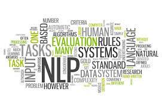

<!-- See: https://github.com/othneildrew/Best-README-Template -->
<a name="readme-top"></a>


<!-- PROJECT SHIELDS -->
[![Contributors][contributors-shield]][contributors-url]
[![Forks][forks-shield]][forks-url]
[![Stargazers][stars-shield]][stars-url]
[![Issues][issues-shield]][issues-url]
[![MIT License][license-shield]][license-url]
[![LinkedIn][linkedin-shield]][linkedin-url]


<!-- PROJECT LOGO -->
<br />
<div align="center">
  <a href="https://github.com/benhhack/basic-keyword-extractor-app">
    
  </a>

<h3 align="center">Basic Keyword Extractor</h3>

  <p align="center">
    A keyword extractor that my friends and I use for job applications.
    <br />
    <!--<a href="https://github.com/benhhack/basic-keyword-extractor-app"><strong>Explore the docs »</strong></a>-->
    <br />
    <br />
    <!--<a href="https://github.com/benhhack/basic-keyword-extractor-app">View Demo</a>-->
    <a href="https://github.com/benhhack/basic-keyword-extractor-app/issues">Report Bug</a>
    ·
    <a href="https://github.combenhhack/basic-keyword-extractor-app/issues">Request Feature</a>
  </p>
</div>


<!-- TABLE OF CONTENTS -->
<details>
  <summary>Table of Contents</summary>
  <ol>
    <li>
      <a href="#about-the-project">About The Project</a>
      <ul>
        <li><a href="#built-with">Built With</a></li>
      </ul>
    </li>
    <li>
      <a href="#getting-started">Getting Started</a>
      <ul>
        <li><a href="#prerequisites">Prerequisites</a></li>
        <li><a href="#installation">Installation</a></li>
      </ul>
    </li>
    <li><a href="#usage">Usage</a></li>
    <li><a href="#roadmap">Roadmap</a></li>
    <li><a href="#contributing">Contributing</a></li>
    <li><a href="#license">License</a></li>
    <li><a href="#contact">Contact</a></li>
    <li><a href="#acknowledgments">Acknowledgments</a></li>
  </ol>
</details>


<!-- ABOUT THE PROJECT -->
## About The Project

<!--[![Product Name Screen Shot][product-screenshot]](https://example.com)-->

After graduating from university, I went off applying for jobs. However, I found that I was not getting any interviews, never mind offers, despite a strong resume.
I did some research and found out that most companies use AI to filter out resumes and, clearly, mine was not making the cut. 
Consequently, I decided to create a keyword extractor to overcome this barrier. 

I hope that anyone who is in this position can use this project effectively. If you're looking for a software dev role, contribute and add this project to your resume!
<p align="right">(<a href="#readme-top">back to top</a>)</p>


### Built With

* [Dash] [dash-url]
* [KeyBERT](https://github.com/MaartenGr/KeyBERT#:~:text=KeyBERT%20is%20a%20minimal%20and,post%20can%20be%20found%20here)

<p align="right">(<a href="#readme-top">back to top</a>)</p>


<!-- GETTING STARTED -->
## Getting Started

Just install and run the project. Note that it is still very early stages and so it is very basic. WIll slowly improve and maintain alongside my job search.

### Prerequisites

* Python: see [this article](https://realpython.com/installing-python/) on Python installation
* Firefox/Google Chrome for testing (default is Firefox)

### Installation

1. Clone the repo
   ```sh
   git clone https://github.com/benhhack/basic-keyword-extractor-app
   ```
2. Run the shell files
   ```sh
   ./runApp.sh
   ```

<p align="right">(<a href="#readme-top">back to top</a>)</p>


<!-- USAGE EXAMPLES 
## Usage

Use this space to show useful examples of how a project can be used. Additional screenshots, code examples and demos work well in this space. You may also link to more resources.

_For more examples, please refer to the [Documentation](https://example.com)_

<p align="right">(<a href="#readme-top">back to top</a>)</p> 


<!-- ROADMAP -->
## Roadmap

- [ ] Tabs for more visualizations
  - [ ] WordCloud
- [ ] Make it prettier
- [ ] Improve the keyword extractor
  - [ ] See ATS requirements and match it
  - [ ] Increase customisability
- [ ] Create a comparison function for resumes.
- [ ] Update tests

<!-- See the [open issues][issues-url] for a full list of proposed features (and known issues). -->

<p align="right">(<a href="#readme-top">back to top</a>)</p>


<!-- CONTRIBUTING -->
## Contributing

Contributions are what make the open source community such an amazing place to learn, inspire, and create. Any contributions you make are **greatly appreciated**.

If you have a suggestion that would make this better, please fork the repo and create a pull request. You can also simply open an issue with the tag "enhancement".
Don't forget to give the project a star! Thanks again!

1. Fork the Project
2. Create your Feature Branch (`git checkout -b feature/AmazingFeature`)
3. Commit your Changes (`git commit -m 'Add some AmazingFeature'`)
4. Push to the Branch (`git push origin feature/AmazingFeature`)
5. Open a Pull Request

<p align="right">(<a href="#readme-top">back to top</a>)</p>


<!-- LICENSE -->
## License

Distributed under the MIT License. See [`LICENSE`][license-url] for more information.

<p align="right">(<a href="#readme-top">back to top</a>)</p>


<!-- CONTACT -->
## Contact

Benjamin Hack - [LinkedIn][linkedin-url] - benhhack@gmail.com

Project Link: [https://github.com/benhhack/basic-keyword-extractor-app](benhhack/basic-keyword-extractor-app)

<p align="right">(<a href="#readme-top">back to top</a>)</p>


<!-- ACKNOWLEDGMENTS -->
## Acknowledgments

* [Quantium Virtual Experience](https://www.theforage.com/virtual-internships/prototype/jhiG2W9K8KLZK8nXP/Quantium:-Software-Engineering-Virtual-Experience-Program?ref=PsadgDZ2Bnb8Z5joN)
* [Keyphrase Extraction with Transformers and Noun Phrases](https://towardsdatascience.com/enhancing-keybert-keyword-extraction-results-with-keyphrasevectorizers-3796fa93f4db)
* [README template](https://github.com/othneildrew/Best-README-Template)
<p align="right">(<a href="#readme-top">back to top</a>)</p>


<!-- MARKDOWN LINKS & IMAGES -->
<!-- https://www.markdownguide.org/basic-syntax/#reference-style-links -->
[contributors-shield]: https://img.shields.io/github/contributors/benhhack/basic-keyword-extractor-app.svg?style=for-the-badge
[contributors-url]: https://github.com/benhhack/basic-keyword-extractor-app/graphs/contributors
[forks-shield]: https://img.shields.io/github/forks/benhhack/basic-keyword-extractor-app.svg?style=for-the-badge
[forks-url]: https://github.com/benhhack/basic-keyword-extractor-app/network/members
[stars-shield]: https://img.shields.io/github/stars/benhhack/basic-keyword-extractor-app.svg?style=for-the-badge
[stars-url]: https://github.com/benhhack/basic-keyword-extractor-app/stargazers
[issues-shield]: https://img.shields.io/github/issues/benhhack/basic-keyword-extractor-app.svg?style=for-the-badge
[issues-url]: https://github.com/benhhack/basic-keyword-extractor-app/issues
[license-shield]: https://img.shields.io/github/license/benhhack/basic-keyword-extractor-app.svg?style=for-the-badge
[license-url]: https://github.com/benhhack/basic-keyword-extractor-app/blob/master/LICENSE
[linkedin-shield]: https://img.shields.io/badge/-LinkedIn-black.svg?style=for-the-badge&logo=linkedin&colorB=555
[linkedin-url]: https://linkedin.com/in/benjaminhhack
[product-screenshot]: images/screenshot.png
[dash-url]: https://plotly.com/dash/
[Next-url]: https://nextjs.org/
[React.js]: https://img.shields.io/badge/React-20232A?style=for-the-badge&logo=react&logoColor=61DAFB
[React-url]: https://reactjs.org/
[Vue.js]: https://img.shields.io/badge/Vue.js-35495E?style=for-the-badge&logo=vuedotjs&logoColor=4FC08D
[Vue-url]: https://vuejs.org/
[Angular.io]: https://img.shields.io/badge/Angular-DD0031?style=for-the-badge&logo=angular&logoColor=white
[Angular-url]: https://angular.io/
[Svelte.dev]: https://img.shields.io/badge/Svelte-4A4A55?style=for-the-badge&logo=svelte&logoColor=FF3E00
[Svelte-url]: https://svelte.dev/
[Laravel.com]: https://img.shields.io/badge/Laravel-FF2D20?style=for-the-badge&logo=laravel&logoColor=white
[Laravel-url]: https://laravel.com
[Bootstrap.com]: https://img.shields.io/badge/Bootstrap-563D7C?style=for-the-badge&logo=bootstrap&logoColor=white
[Bootstrap-url]: https://getbootstrap.com
[JQuery.com]: https://img.shields.io/badge/jQuery-0769AD?style=for-the-badge&logo=jquery&logoColor=white
[JQuery-url]: https://jquery.com 
